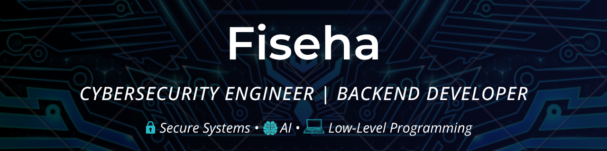

# Fiseha Mengistu

Cybersecurity Engineering student focused on secure systems, backend development, and applied cryptography.

---

## About

I build systems with a strong emphasis on **security, performance, and correctness**.  
My work includes low-level programming in **C**, backend services, and security-focused applications.

- 🔐 Focus areas: system security, authentication, secure storage  
- 🤖 Currently building: AI-powered study assistant for Ethiopian students  
- 🎯 Goal: Security Engineer / Red Teaming  

---

## Tech Stack

**Languages:** C, Python, JavaScript  

**Systems & Security:** Linux, Bash, OpenSSL, Cryptography fundamentals  

**Backend & Database:** Node.js, PostgreSQL  

---

## Projects

### Secure Password Vault
- **Problem:** Users need safe storage for sensitive credentials  
- **Solution:** Encrypted credential storage using OpenSSL with PostgreSQL integration  
- **Key Skills:** Encryption, authentication, database design  

### HTTP Web Server in C
- **Problem:** Learn low-level networking & server design  
- **Solution:** Custom-built server handling routing, requests, and basic authentication  
- **Key Skills:** Sockets, C programming, low-level system operations  

### AI Study Assistant (In Progress)
- **Problem:** Ethiopian students struggle with large class sizes and personalized learning  
- **Solution:** AI-powered recommendation and study system using NLP and logic  
- **Key Skills:** Python, AI, NLP, backend design  

---

## GitHub Stats

---

## Contribution Activity

---

## Contact

- LinkedIn: (add your link)  
- Email: (optional)
